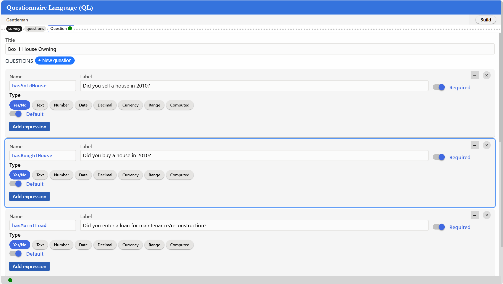
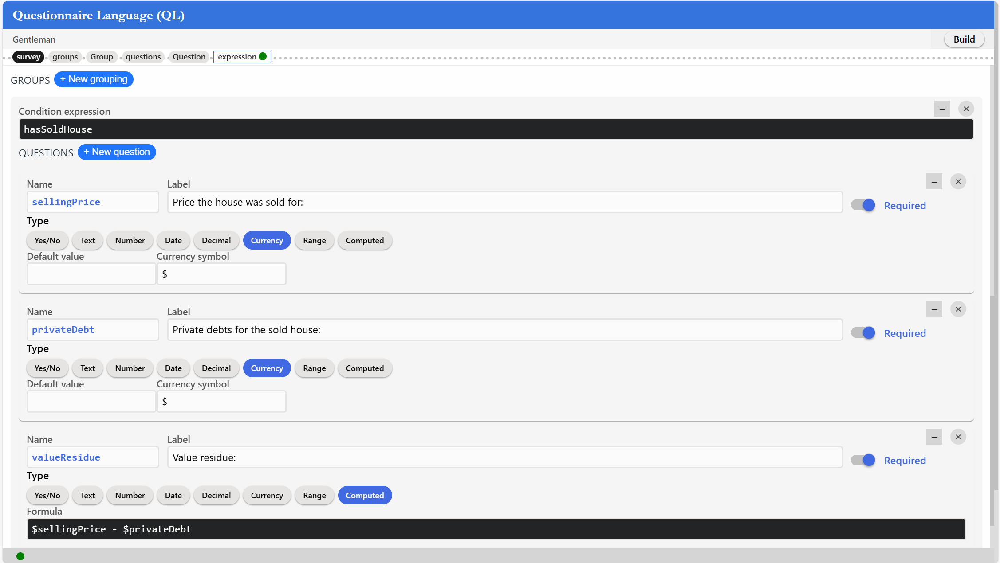
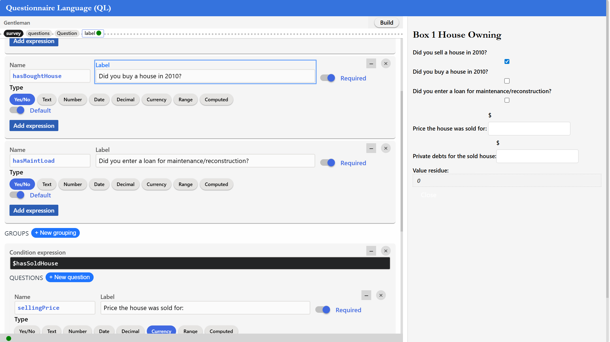

# gentleman-lwb25

This repository showcases an implementation of the Questionnaire Language (QL) using Gentleman, a lightweight web‑based projectional editor. 
The goal is to demonstrate how concepts (metamodel) and projections (concrete syntax) in Gentleman can be composed to model, render, validate, and execute dynamic questionnaires with conditional logic and computed fields.

## Context

### About Gentleman

Gentleman is a lightweight web‑based projectional editor that aims to make modeling more accessible to domain experts and practitioners (outside traditional software engineering). The editor surface is a composition of projections (graphical, tabular, textual, and interactive widgets) bound to concepts that structure the model data. Instead of relying on parsing text into an abstract syntax tree (AST), Gentleman directly edits the AST through projections. This eliminates syntax errors and supports a wide range of notations—textual, graphical, tabular, and interactive widgets.
Gentleman emphasizes simplicity and flexibility. Its minimalistic web-based design reduces visual clutter and focuses attention on the modeling activity itself. By being distributed as a JavaScript library, it can be embedded in any web application, enabling smooth integration into existing workflows. Projections can be styled, customized, and reused, making the tool adaptable to various domains and user needs.

### About the LWB Challenge & the QL task

The Language Workbench Challenge, initiated in 2013, aims to demonstrate the capabilities of modern language workbenches by modeling and implementing a relatively simple but representative DSL. For the 2025 edition, the language to implement is the **Questionnaire Language (QL)**.
The QL task asks participants to implement a small DSL for **questionnaires** featuring: questions grouped in forms; labels; types; optional computed values; **conditional visibility and grouping**; and an expression language for conditions and computations. A QL description should render to a GUI where enabled questions become visible and computed values update live. (The optional QLS layer adds layout/styling and widget choices.)

## Our implementation

### Screenshots of the implementation

#### Defining the questionnaire


#### Defining the questionnaire (group questions)


#### Previewing the generated GUI


### Metamodel — concepts

Here are the concepts defined in Gentleman to model the Questionnaire Language :

#### Survey

* **Nature** : concrete concept.
* **Attributs** :

  | Nom       | Type          | Required    | Description            |
  | --------- | ------------- | ----------- | ---------------------- |
  | title     | string        | yes         | Questionnaire title    |
  | questions | set<Question> | yes         | List of questions      |
  | groups    | set<Group>    | no          | List of groups         |

#### Group

* **Nature** : concrete concept to organize questions.
* **Attributs** :

  | Nom        | Type          | Required    | Description           |
  | ---------- | ------------- | ----------- | --------------------- |
  | name       | string        | yes         | Name of the group     |
  | expression | string        | no          | Display condition     |
  | order      | number        | yes         | Presentation order    |
  | questions  | set<Question> | yes         | List of questions     |

#### Question

* **Nature** : concrete concept to represent a question.
* **Attributs** :

  | Nom        | Type                | Required    | Description                                 |
  | ---------- | ------------------- | ----------- | ------------------------------------------- |
  | name       | string              | yes         | Question identifier                         |
  | label      | string              | yes         | Text displayed next to the widget           |
  | type       | QuestionType        | yes         | Question type                               |
  | expression | string              | no          | Visibility condition                        |
  | order      | number              | yes         | Position in questionnaire                   |
  | required   | boolean             | yes         | Indicates whether the question is mandatory |

#### QuestionType (prototype)

* Prototype concept used to define multiple concrete (concept) question types :

  | Type         | Alias    | Attributes                              |
  | ------------ | -------- | --------------------------------------- |
  | YesNoType    | boolean  | default value (boolean)                 |
  | TextType     | string   | default value, minLength, maxLength     |
  | NumberType   | int      | default value, min, max                 |
  | DateType     | date     | default value, format                   |
  | DecimalType  | decimal  | default value, precision                |
  | CurrencyType | money    | default value, symbol, decimal          |
  | RangeType    | range    | default value, min, max, increment      |
  | ComputedType | computed | formula                                 |


### Concrete syntax — projections

The projections are defined in the `model/projections.json` file.

Below is the projection used against the `survey` concept. The projection presents a container with three properties `content`, `style`, and `layout`. 
- `content`: list of elements presented in the projection
  - `{ type: 'attribute', name: 'title' }`: renders a projection for the `title` attribute. As it is a `string`, a *textfield* will be rendered.
  - `{ type: 'attribute', name: 'questions' }`: renders a projection for the `questions` attribute. As it is a `set` (of questions), a *listfield* will be rendered.
  - `{ type: 'attribute', name: 'groups' }`: renders a projection for the `groups` attribute. As it is a `set` (of groups), a *listfield* will be rendered.
- `style`: styling attached to the container
  - `css: ['survey']`: adds the class `survey` to the container.
- `layout`: organizes the content using a *flex* layout
```json
{
    "concept": { "name": "survey" },
    "tags": ["survey"],
    "container": {
        "content": [
            {
                "type": "attribute",
                "name": "title",
                "tag": "textbox-label"
            },
            {
                "type": "attribute",
                "name": "questions",
                "tag": "questions"
            },
            {
                "type": "attribute",
                "name": "groups",
                "tag": "groups",
                "style": {
                    "box": {
                        "outer": { 
                            "top": { "value": 12, "unit": "px"}
                        }
                    }
                }
            }
        ],
        "style": {
            "css": ["survey"]
        },
        "layout": {
            "type": "flex",
            "orientation": "column",
            "wrappable": false
        }
    }
}
```

### Styling & personalization

As Gentleman is based on the web, the presentation can be customized fully by editing the stylesheet `styles.css` or adding another stylesheet. In the case of the later, a reference to the created stylesheet should be added to the page `index.html`.

<!-- ### Limitations -->

<!-- TODO -->

## Quick start

1. Open the file `demo/index.html` in a browser. It conains all resources required to use the model and generate the questionnaire.
   1. The model should be presented
2. Define the questionnaire
   1. Give the questionnaire a title
   2. Create questions by clicking on `New question` next to the `QUESTIONS` title
   3. Create groups by clicking on `New grouping` next to the `GROUPS` title
3. Define your questions. For each question:
   1. Give it a name, label, and order (optionnal)
   2. Give a type by selecting on the type options
      1. Each type has options that can be used to restrict or configure the values accepted for the question
   3. Click on `Add expression` to define an exception for the question
   4. Check or uncheck the `required` switch to indicate whether the question is mandatory
4. Define your groupings. For each group:
   1. Give it a name and order (optionnal)
   2. Define an expression on the group
   3. Define the group questions similar to step 3.
5. Click on the `Build` button to generate a questionnaire from the current model

## Contact

For any question, please communicate with [Louis-Edouard Lafontant](mailto:louis.edouard.lafontant@umontreal.ca)